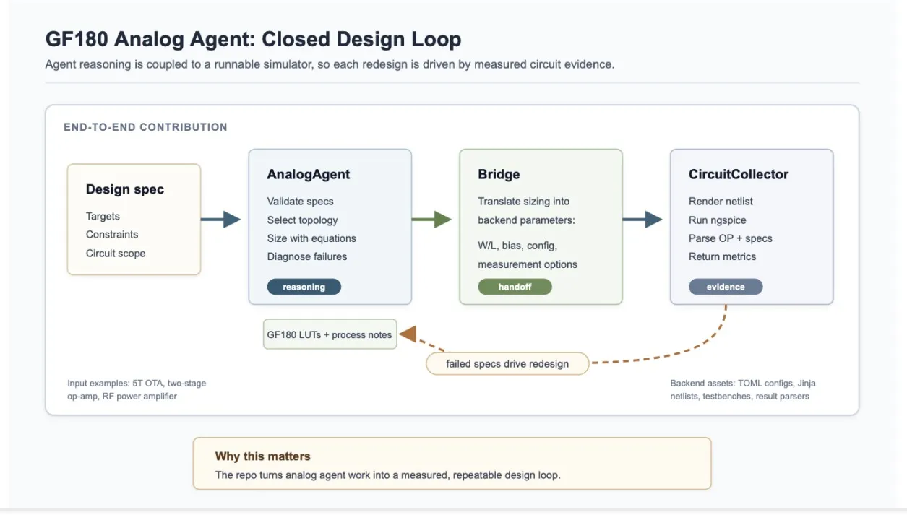
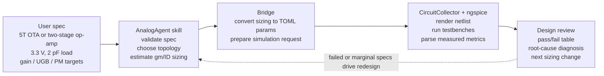

# GF180 Analog Agent

An open-source experiment in using AI agents to help design analog and RF
circuits on the open GF180MCU-D process.

Analog chip design is one of the quiet bottlenecks in modern hardware. Digital
systems get the headlines, but every real product still has to sense the world,
condition noisy signals, deliver power, drive radios, bias devices, and survive
process, voltage, and temperature variation. The Semiconductor Industry
Association describes analog semiconductors as the devices that translate
real-world signals such as sound, temperature, light, and voltage into digital
data, or vice versa. Semiconductors also power the products that shape daily
life, from phones and cars to medical equipment, defense systems, data centers,
and cloud infrastructure. [SIA: What are Semiconductors?](https://www.semiconductors.org/semiconductors-101/what-are-semiconductors/)
[SIA: Why are Semiconductors Important?](https://www.semiconductors.org/semiconductors-101/why-are-semiconductors-important/)

At the same time, semiconductor talent is scarce. SIA projects the U.S.
semiconductor workforce will need to grow by nearly 115,000 jobs by 2030, with
roughly 67,000 of those jobs at risk of going unfilled at current degree
completion rates. That shortage is especially painful for analog work, where
the craft depends on tacit knowledge, device intuition, topology tradeoffs, and
repeated simulator-driven refinement. [SIA: Chipping Away](https://www.semiconductors.org/chipping-away-assessing-and-addressing-the-labor-market-gap-facing-the-u-s-semiconductor-industry/)

This repo asks a practical question:

> Can an AI agent become a useful junior analog-design partner if its reasoning
> is grounded in runnable circuit simulation instead of prose alone?

It is not trying to replace expert designers or claim signoff-ready silicon.
Instead, it packages an early closed-loop design workflow: an agent reads a
spec, chooses or sizes a topology, hands concrete parameters to a simulator,
parses measured results, diagnoses misses, and iterates. That makes the design
conversation inspectable, repeatable, and anchored in circuit evidence.



## Project Summary

- **Problem:** analog and RF design expertise is scarce, slow to train, and
  hard to scale.
- **Why it matters:** analog circuits are the physical interface for sensing,
  power, communications, and mixed-signal systems.
- **Approach:** combine an LLM agent, reusable circuit-design skills, GF180
  gm/ID lookup tables, and a runnable ngspice backend.
- **Open foundation:** build on open PDK and EDA infrastructure so students,
  researchers, and independent builders can run the flow without proprietary
  tooling as the first gate.
- **Contribution:** a working starter kit that turns natural-language design
  specs into simulator-backed analog/RF design reviews.
- **Demo path:** run the setup notebook, start the CircuitCollector API, then
  ask the agent to design a 5T OTA, two-stage op-amp, or RF power amplifier.

## Why Now?

The semiconductor industry is entering another growth wave. McKinsey estimates
that semiconductor revenue could reach $1.6 trillion by 2030, up from $775
billion in 2024, driven by AI, edge devices, domain-specific architectures, and
next-generation technologies. McKinsey also highlights portfolio breadth in
analog, connectivity, and power as a durable semiconductor strategy. [McKinsey:
The next era of semiconductor value creation](https://www.mckinsey.com/industries/semiconductors/our-insights/the-next-era-of-semiconductor-value-creation)

Commercial EDA vendors are already moving toward AI-assisted workflows. For
example, Synopsys describes AI solutions for analog and mixed-signal engineers
that target design migration, multi-objective optimization, and simulation-heavy
PVT exploration. This project explores the same broad direction in a small,
open, reproducible form: keep the agent honest by coupling it to a real
simulator and explicit backend contract. [Synopsys.ai](https://www.synopsys.com/ai.html)

The other reason this is possible now is the rise of open silicon
infrastructure. The [GlobalFoundries GF180MCU Open Source PDK](https://github.com/google/gf180mcu-pdk),
created through a Google and GlobalFoundries collaboration, makes a real 180 nm
process available for learning and test-chip oriented work. The
[IIC-OSIC-TOOLS](https://github.com/iic-jku/IIC-OSIC-TOOLS) container packages
open-source IC design tools for analog and digital flows around processes such
as GF180. [ngspice](https://ngspice.sourceforge.io/) provides the open-source
SPICE simulation engine used by this repo's backend. Together, these tools
significantly reduce the barrier to entry: a learner can move from a circuit
spec to a runnable simulation loop without first assembling a proprietary EDA
environment.

## What This Project Does

GF180 Analog Agent combines two layers:

1. **AnalogAgent:** circuit-specific skills that guide an AI agent through spec
   validation, topology selection, first-pass sizing, simulation review, and
   failure diagnosis.
2. **CircuitCollector:** a FastAPI/ngspice backend that renders netlists from
   TOML/Jinja templates, runs simulations in the IIC-OSIC-TOOLS container, and
   returns parsed operating-point and performance metrics.

The repo is intentionally built on an open stack: GF180MCU-D process assets,
ngspice simulation, Python/FastAPI services, Jupyter notebooks, TOML/Jinja
templates, and markdown-based agent skills. That keeps the workflow inspectable
and makes it easier for contributors to add new circuit types, compare agent
decisions against measured simulation outputs, or adapt the bridge to other
open PDKs.

The current bundle supports:

- GF180MCU-D analog-amplifier exploration, including 5T OTA and two-stage
  Miller-style amplifier examples.
- GF180MCU-D RF power-amplifier exploration, including class/topology guidance
  and runnable backend smoke tests.
- A backend contract for adding new circuit types with matching skills, TOML
  configs, netlist templates, testbenches, parsers, and smoke tests.

## Demo

Here is the project at a glance for one simple analog-amplifier request:



| Demo stage | What the reader should notice |
| --- | --- |
| Input | A natural-language circuit spec becomes a structured design task. |
| Skill reasoning | The agent uses circuit-specific design notes instead of a generic prompt alone. |
| Simulator call | The proposed sizing is checked by ngspice through the API. |
| Output | The review is based on measured metrics, and misses become the next iteration. |

The fastest demo is the notebook-driven local flow:

1. Start the IIC-OSIC-TOOLS Docker/Jupyter environment.
2. Open `notebooks/setup_and_run_gf180_analog.ipynb`.
3. Connect it to the container's Jupyter kernel.
4. Run all cells. The notebook links the GF180 PDK, installs CircuitCollector,
   starts the API, checks `/health`, and runs smoke tests.
5. Open your coding agent from this repo and paste one of the prompts in
   [Agent Prompts](#agent-prompts).

Expected demo behavior:

- The health check returns `{"status":"ok"}`.
- The analog-amplifier smoke test sends a 5T OTA sizing payload to
  `http://localhost:8001/simulate/` and receives parsed metrics.
- The RFPA smoke test returns large-signal metrics such as `pout_w`,
  `pout_dbm`, `pdc_w`, `idc_total`, `drain_efficiency`, `iout_rms`, and
  `iout_pk_est`.
- The agent can then use failed or marginal specs as evidence for another
  design iteration.

The demo is intentionally schematic-level. Final silicon signoff still requires
layout, parasitic extraction, PVT/corner closure, EM/package/reference-plane
work where applicable, and expert review.

## Quick Start

1. Start the IIC-OSIC-TOOLS Docker/Jupyter environment.

2. Place this folder under the host designs directory:

```text
/Users/<user_name>/eda/designs/share_GF180_Analog
```

The container should see it at:

```text
/foss/designs/share_GF180_Analog
```

3. Open this notebook from your local file browser:

```text
share_GF180_Analog/notebooks/setup_and_run_gf180_analog.ipynb
```

4. Connect the notebook to the container's Jupyter kernel.

5. Run the notebook cells in order. The notebook links the GF180 PDK, installs
CircuitCollector in the container Python environment, starts the API, checks
`/health`, and runs quick analog-amplifier and RFPA smoke tests.

6. After the notebook reports a healthy API, open your coding agent from the
`share_GF180_Analog` folder and give it one of the prompts below.

## Agent Prompts

### RF Power Amplifier

```text
I want to design and review a GF180MCU-D RF power amplifier.

Container: <container_id_or_name>
CircuitCollector API: http://localhost:8001/simulate/

Run all simulations in the container environment. Do not run ngspice or
CircuitCollector from the host Python environment.

Use this nominal starting spec:
- Design scope: on-chip core only
- Process: GF180MCU-D
- VDD: 3.3 V
- f0: 250 MHz
- Load: 50 ohm
- Target Pout: 2 mW
- PA_class: auto
- Max DC power: 33 mW
- Max total DC current: 10 mA
- Max output RMS current: 10 mA
- Max output peak current: 10 mA
- Max device voltage: 3.3 V
- Passive scope: finite-Q schematic passives only; no EM/layout signoff
```

### Analog Amplifier

```text
I want to design and review a GF180MCU-D analog amplifier.

Container: <container_id_or_name>
CircuitCollector API: http://localhost:8001/simulate/

Run all simulations in the container environment. Do not run ngspice or
CircuitCollector from the host Python environment.

Use this nominal starting spec:
- Design scope: schematic-level amplifier
- Process: GF180MCU-D
- Supply: 3.3 V
- Candidate topologies: 5T OTA or two-stage Miller op-amp
- Load capacitance: 2 pF
- Target DC gain: at least 40 dB
- Target unity-gain bandwidth: at least 1 MHz
- Target phase margin: at least 60 deg
- Power: minimize while meeting specs
```

If the agent is already running inside the container-backed notebook
environment, the container ID is just a note; the API URL and container-visible
path are the important handles.

## Environment

This bundle was tested with the IEEE SSCS Chipathon IIC-OSIC-TOOLS
Docker/Jupyter environment:

```text
https://github.com/sscs-ose/sscs-chipathon-2026/tree/main/resources/IIC-OSIC-TOOLS
```

That environment mounts the host designs directory into the container. This is
why `/Users/<user_name>/eda/designs/share_GF180_Analog` appears as
`/foss/designs/share_GF180_Analog` from the connected notebook kernel.

## What's Included

- `AnalogAgent/skills/analog-amplifier/`: analog amplifier design workflow for
  5T OTA and two-stage Miller-style amplifier examples.
- `AnalogAgent/tools/`: helper bridge used by the analog-amplifier skill to
  convert gm/ID sizing targets, call CircuitCollector, and collect waveforms.
- `AnalogAgent/asset_gf180mcuD/`: characterized GF180 gm/ID LUT tables for the
  bundled analog-amplifier flow.
- `AnalogAgent/skills/rf-power-amplifier/`: RFPA design workflow, GF180 process
  notes, topology guidance, backend adapter, and helper scripts.
- `AnalogAgent/templates/`: reusable spec-form templates.
- `CircuitCollector/`: FastAPI simulation service and CircuitCollector Python
  package.
- `CircuitCollector/CircuitCollector/config/gf180mcuD/opamp/`: GF180 op-amp
  TOML configs.
- `CircuitCollector/CircuitCollector/config/gf180mcuD/rfpa/`: GF180 RFPA TOML
  configs.
- `CircuitCollector/CircuitCollector/circuits/`: netlist templates.
- `CircuitCollector/CircuitCollector/spec_lib/`: testbench templates.
- `docs/`: notes for extending the bundle to new circuit types.
- `notebooks/setup_and_run_gf180_analog.ipynb`: setup and smoke-test notebook.

The GF180 PDK is not included. The setup notebook links the container's PDK into:

```text
/foss/designs/share_GF180_Analog/CircuitCollector/CircuitCollector/PDK/gf180mcuD
```

## Notebook Notes

The first setup cell prints:

```text
kernel cwd
share root
CircuitCollector repo
RFPA skill root
Analog amplifier skill root
```

The share root should resolve to:

```text
/foss/designs/share_GF180_Analog
```

If it does not, set `SHARE_ROOT` manually in the first setup cell:

```python
SHARE_ROOT = Path("/foss/designs/share_GF180_Analog")
```

The PDK cell auto-detects common IIC-OSIC-TOOLS locations such as:

```text
/foss/pdks/ciel/gf180mcu/versions/*/gf180mcuD
```

If auto-detection fails, set `PDK_SRC` manually in the first setup cell:

```python
PDK_SRC = Path("/container/path/to/gf180mcuD")
```

A valid PDK path must contain:

```text
libs.tech/ngspice/design.ngspice
libs.tech/ngspice/sm141064.ngspice
```

Before starting a fresh API, the notebook stops old uvicorn processes whose
command line contains `CircuitCollector.api.main:app`. This avoids stale
CircuitCollector servers from previous notebooks.

When running Python helper snippets from the analog-amplifier skill, use
`/foss/designs/share_GF180_Analog/AnalogAgent` as the working directory, or add
that directory to `PYTHONPATH`, so imports such as `from tools import ...` and
`from scripts.lut_lookup import ...` resolve correctly.

## Optional Checks

Analog-amplifier LUT check:

```bash
cd /foss/designs/share_GF180_Analog/AnalogAgent
python3 - <<'PY'
from scripts.lut_lookup import list_available_L
print(list_available_L("nfet_03v3", corner="typical", temp="25C")[:5])
print(list_available_L("pfet_03v3", corner="typical", temp="25C")[:5])
PY
```

Analog-amplifier API smoke test:

```bash
python3 - <<'PY'
import json, urllib.request
payload = {
    "base_config_path": "config/gf180mcuD/opamp/5tota_single_gf180.toml",
    "params": {
        "M1_L": 0.56, "M1_WL_ratio": 3.0, "M1_M": 2,
        "M3_L": 0.56, "M3_WL_ratio": 2.0, "M3_M": 1,
        "M4_L": 0.56, "M4_WL_ratio": 2.0, "M4_M": 1,
        "M5_L": 0.56, "M5_WL_ratio": 2.0, "M5_M": 2,
        "ibias": 3e-5,
        "measure_mismatch": False,
        "measure_noise": False,
        "measure_slew_rate": False,
        "measure_output_swing": False,
    },
}
req = urllib.request.Request(
    "http://localhost:8001/simulate/",
    data=json.dumps(payload).encode(),
    headers={"Content-Type": "application/json"},
    method="POST",
)
with urllib.request.urlopen(req, timeout=120) as r:
    print(json.dumps(json.loads(r.read()), indent=2))
PY
```

RFPA backend coverage:

```bash
cd /foss/designs/share_GF180_Analog/AnalogAgent
python3 skills/rf-power-amplifier/scripts/check_backend_coverage.py \
  --backend-root /foss/designs/share_GF180_Analog/CircuitCollector/CircuitCollector
```

RFPA smoke test:

```bash
cd /foss/designs/share_GF180_Analog/AnalogAgent
python3 skills/rf-power-amplifier/scripts/smoke_test_backend.py \
  --backend-root /foss/designs/share_GF180_Analog/CircuitCollector/CircuitCollector \
  --api-url http://localhost:8001/simulate/ \
  --quick \
  --topology two_stage_single_ended
```

Expected RFPA smoke-test behavior: `two_stage_single_ended` should run and
return parsed large-signal metrics such as `pout_w`, `pout_dbm`, `pdc_w`,
`idc_total`, `drain_efficiency`, `iout_rms`, and `iout_pk_est`.

## Extending To New Circuit Types

See:

```text
docs/adding_new_circuit_type.md
docs/backend_contract.md
docs/agent_prompt_examples.md
```

The short version:

1. Add a new skill under `AnalogAgent/skills/<circuit-skill>/`.
2. Add GF180 configs under `CircuitCollector/CircuitCollector/config/gf180mcuD/<circuit_type>/`.
3. Add netlist templates under `CircuitCollector/CircuitCollector/circuits/<circuit_type>/`.
4. Add testbench templates under `CircuitCollector/CircuitCollector/spec_lib/<circuit_type>/`.
5. Add a coverage/smoke-test script or extend an existing one.
6. Add one example spec and one design-review format.

## Troubleshooting

If the API is not healthy, inspect:

```text
/foss/designs/share_GF180_Analog/circuitcollector_api.log
```

To manually stop old API servers in the container:

```bash
pgrep -af 'CircuitCollector.api.main:app'
pkill -f 'uvicorn.*CircuitCollector.api.main:app'
```

To verify the API:

```bash
curl http://localhost:8001/health
```

Expected response:

```json
{"status":"ok"}
```

If the PDK setup cell reports `OSError: [Errno 22] Invalid argument` while
checking `PDK/gf180mcuD`, it usually means an old or host-incompatible PDK
symlink is present. Rerun the updated PDK setup cell; it treats invalid links
as stale and replaces them with the detected container PDK path.

## Notes

- Do not commit GF180 PDK contents into this folder.
- Some backend templates are idealized seeds. They are useful for topology
  exploration and API validation; final signoff still needs layout, parasitic,
  PVT, and reference-plane closure appropriate to the circuit type.

## Acknowledgements

This work is based on and extends the AnalogAgent/CircuitCollector flow from:

```text
https://github.com/jiyuanduan001-oss/LLM_Amplifier_Sizing
```

The original project provides the LLM-assisted analog sizing framework,
CircuitCollector FastAPI simulation backend, and procedural skill-stack
approach. This bundle adapts that flow for GF180MCU-D analog and RF circuit
exploration inside IIC-OSIC-TOOLS.

This project also depends on the open silicon ecosystem around:

- [GlobalFoundries GF180MCU Open Source PDK](https://github.com/google/gf180mcu-pdk),
  a Google and GlobalFoundries collaboration that makes GF180MCU design
  resources available for open-source silicon work.
- [IIC-OSIC-TOOLS](https://github.com/iic-jku/IIC-OSIC-TOOLS), the containerized
  open-source IC design environment used by this flow.
- [ngspice](https://ngspice.sourceforge.io/), the open-source SPICE simulator
  used to ground agent recommendations in measured circuit behavior.
